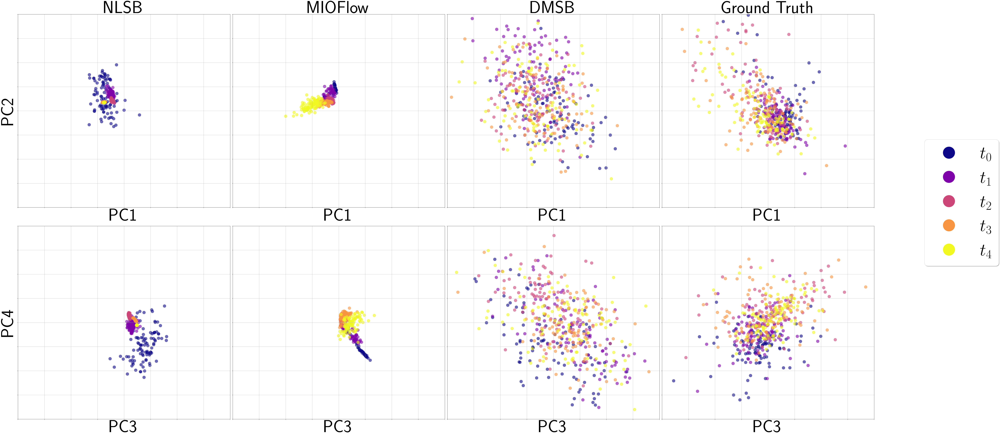

# Additional Figures for Reviewer CThW

  

<h1 align="center">Figure.A.1: Fine-tuned MIOFlow on Petal dataset</h1>

&emsp;
&emsp;

  

<h1 align="center">Figure.A.2: Position Results of all models on 5-D RNAsc dataset</h1>

&emsp;
&emsp;

  

<h1 align="center">Figure.A.3: Velocity Results of all models on 5-D RNAsc dataset</h1>

&emsp;
&emsp;

  

<h1 align="center">Figure.A.4: Position Results of all models on 100-D RNAsc dataset</h1>

&emsp;
&emsp;

  

<h1 align="center">Figure.A.5: Velocity Results of all models on 100-D RNAsc dataset</h1>

&emsp;
&emsp;

  

<h1 align="center">Figure.A.6: Detailed Velocity Results of DMSB on 100-D RNAsc dataset</h1>
